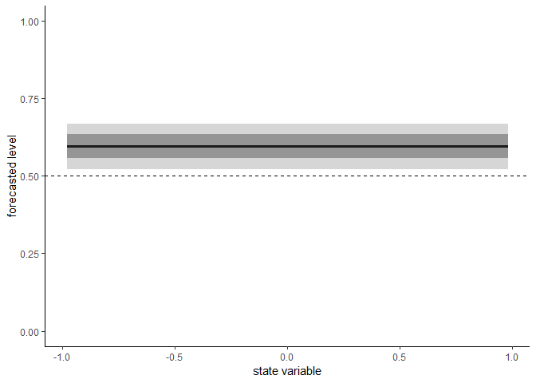

<!-- README.md is generated from README.Rmd. Please edit that file -->

# PointFore

The goal of PointFore is to estimate specification models for the
state-dependent level of an optimal quantile/expectile forecast.

Wald Tests and the test of overidentifying restrictions are implemented.
Plotting of the estimated specification model is possible.

Based on “Interpretation of Point Forecasts with unknown directive” by
Patrick Schmidt, Matthias Katzfuss, and Tilmann Gneiting, 2018.

## Installation

You can install PointFore from github with:

``` r
# install.packages("devtools")
devtools::install_github("Schmidtpk/PointFore")
```

## Example

This is a basic example which shows you how to evaluate which quantile
is forecasted by the Greenbook GDP forecasts:

``` r
library(PointFore)
#> 
#> Attaching package: 'PointFore'
#> The following object is masked from 'package:stats':
#> 
#>     lag
#> The following object is masked from 'package:dplyr':
#> 
#>     lag

res <- estimate.functional(Y=GDP$observation,
                           X=GDP$forecast,
                           instruments = c("X","lag(Y,2)"))
#> Drop  2 case(s) because of chosen instruments
#> Choose parameter theta0 automatically.

summary(res)
#> $call
#> estimate.functional(Y = GDP$observation, X = GDP$forecast, instruments = c("X", 
#>     "lag(Y,2)"))
#> 
#> $coefficients
#>           Estimate Std. Error  t value     Pr(>|t|)
#> Theta[1] 0.6043907 0.04349627 13.89523 6.770319e-44
#> 
#> $Jtest
#> 
#>  ##  J-Test: degrees of freedom is 2  ## 
#> 
#>                 J-test    P-value 
#> Test E(g)=0:    5.190767  0.074617

plot(res)
```

<!-- -->

On average the forecast is over-optimistic with a forecasted quantile of
0.6. The J-test rejects optimality for this model.

In the next step, we apply a more general model, where the forecasted
quantile depends on the current forecast via a linear probit model.

``` r
res <- estimate.functional(Y=GDP$observation,X=GDP$forecast,
                           model=probit_linear,
                           instruments = c("X","lag(Y,2)"),
                           stateVariable = GDP$forecast)
#> Drop  2 case(s) because of chosen instruments
#> Choose parameter theta0 automatically.


summary(res)
#> $call
#> estimate.functional(model = probit_linear, Y = GDP$observation, 
#>     X = GDP$forecast, stateVariable = GDP$forecast, instruments = c("X", 
#>         "lag(Y,2)"))
#> 
#> $coefficients
#>            Estimate Std. Error    t value   Pr(>|t|)
#> Theta[1] -0.1051757 0.16848538 -0.6242421 0.53246863
#> Theta[2]  0.1147590 0.04533712  2.5312375 0.01136608
#> 
#> $Jtest
#> 
#>  ##  J-Test: degrees of freedom is 1  ## 
#> 
#>                 J-test   P-value
#> Test E(g)=0:    0.46912  0.49339
plot(res)
```

<!-- -->

We see that the forecast is overly optimistic in times of high growth.
For this model we cannot reject optimality with a p-value of 0.493 in
the J-Test of overidentifying restrictions.
